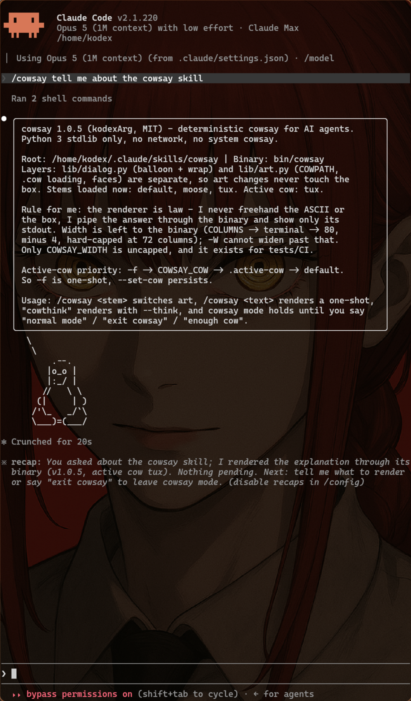

# cowsay 🐮



A cow that talks in your agent's terminal. Python 3 **stdlib only** — no
network, no pip, no system `cowsay`. **MIT**, by [kodexArg](https://kodexarg.com).

```bash
npx skills add kodexArg/cowsay
```

## Talk to it

| You say | It does |
|---|---|
| `/cowsay` | cow mode — every reply comes out of the cow |
| `/cowsay tux` | swap the art (persists) |
| `/cowsay hello world` | one-shot render |
| "cowthink" | thought bubbles instead of speech |
| "enough cow" | back to normal |

## Or use the CLI

```bash
printf 'moo' | bin/cowsay             # ← the whole thing
printf 'hmm' | bin/cowsay --think     # 💭
bin/cowsay -l                         # default · moose · tux
bin/cowsay --set-cow tux              # 🐧 forever
```

Active cow wins in this order: `-f` → `COWSAY_COW` → `.active-cow` → `default`.
Width takes care of itself (capped at 72 columns so it always fits) — just don't
pass `-W`.

## Why it exists

Agents freehand ASCII art, and it comes out crooked. So the rule is
**the renderer is law**: the agent pipes its answer through `bin/cowsay` and
shows only stdout. Deterministic box, every time.

```text
skills/cowsay/
  SKILL.md        agent instructions
  bin/cowsay      compose
  lib/dialog.py   the balloon
  lib/art.py      the animal
  cows/*.cow      more animals — drop yours in, or point COWPATH at them
  tests/          goldens
```

Dialog and art are separate layers, so a new cow never touches the box.

```bash
python3 tests/test_cowsay.py
```

🙏 Original cowsay by Tony Monroe — <https://github.com/cowsay-org/cowsay>
